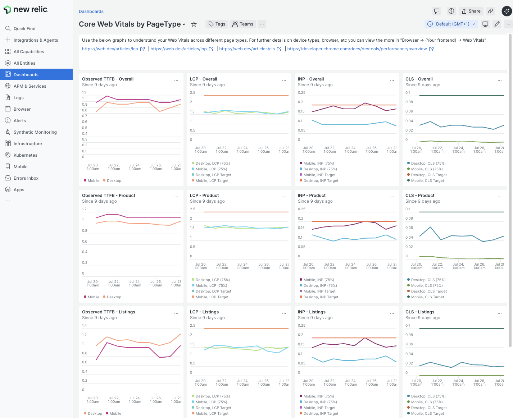

# gene/module-newrelic-rum-page-type

Install this module to track your [Core Web Vitals](https://web.dev/articles/vitals) in New Relic by page type. This allows you to easily monitor and improve customers experience on your website.

🎉 If you are hosted on Adobe Commerce Cloud you already have New Relic with browser monitoring available! 🎉 Install this module to quickly enhance your [RUM](https://newrelic.com/blog/best-practices/what-is-real-user-monitoring) setup and see what your customers are experiencing.

## Why install it?

By default New Relic is already tracking LCP, INP, and CLS on page views. This is recorded and queryable within New Relic.  However you can only filter by some default values like `domain` or `pageUrl`. This granularity is insufficient for tracking changes and making targeted improvements on your ecommerce site. 

To be able to make impactful changes we need to tbe able to answer questions like
- What are customers experiencing on the whole domain?
- What are customers experiencing on product pages?
- What are customers experiencing in the checkout?

By adding this module you will have this level of detail and be able to make more informed decisions and stay ahead of any regressions.

## Installation

```
composer require gene/module-newrelic-rum-page-type
bin/magento setup:upgrade
```

## How it works

This module adds a custom attribute to the New Relic PageViewTiming data to set the current request type as `pageType`. 

This allows you to query the tracked data in segments like 
- `cms_index_index` - the homepage
- `catalog_product_view` - product pages
- `catalog_category_view` - listings pages
- `checkout_index_index` - the checkout

## How to use

### 1. Prepare a New Relic dashboard

It is best to view this data within a New Relic dashboard. We have prepared a dashboard template for you to get started with

1. Copy the contents of `dev/new-relic-cwv-dashboard.json` into a text editor
1. Replace the dummy `1234567` account ID with your actual New Relic account ID
2. Replace `www.example.com` with your actual domain. 
1. Log into New Relic
1. On the left panel click "Dashboards"
3. On the top right click "Import Dashboard"
4. Paste in the prepared JSON dashboard and import the "Core Web Vitals by PageType" dashboard.
5. You will now see a dashboard highlighting your Core Web Vitals.

This LCP/INP/CLS charts have a horizontal target line, your web vitals for desktop and mobile should be below this target line.



### 2. Deploy this module to production

1. Install this module on production. PageViewTiming metrics within New Relic will now have their `pageType` value attached. 
2. Give it at least 24 hours for data to start filtering through, depending on your site and setup you may find patterns that some periods are slower when imports/exports are being triggered. 

### 3. Filter by pageType to identify areas for improvement

1. When no filter is applied you can see the overall scores for your website. 
2. By filtering through `catalog_product_view`, `catalog_category_view`, etc you can identify areas for improvement and whether they are most significantly affecting desktop or mobile devices.

### 4. Set up automated alerting 

1. After you have improved your web vitals you want to monitor them to prevent regression.
1. From the dashboard click `...` on the top right of CLS/INP/LCP
2. Create an alert condition
3. Follow instructions from https://docs.newrelic.com/docs/tutorial-create-alerts/create-an-alert/

Tips
1. Alerting on a 24-hour rolling window seems to be the most stable.
2. Have an alert for desktop, and one for mobile.
3. Have alerts for specific page types, so that you are quickly alerted when something goes awry.
4. Alerts can fire even when no deployments are made, changes in audience, third party tracking, or A/B testers may be the cause. 

## Caveats

New Relic RUM is not as complete as some other offerings, most notably it is missing [LoAF](https://support.newrelic.com/s/hubtopic/aAXPh0000007Zgz/browser-monitoring-interaction-to-next-paint-inp-loaf-support). However, if you already have New Relic and are not currently looking at your RUM data then this module may be enough to get you kick-started on that journey and making targeted improvements.   
